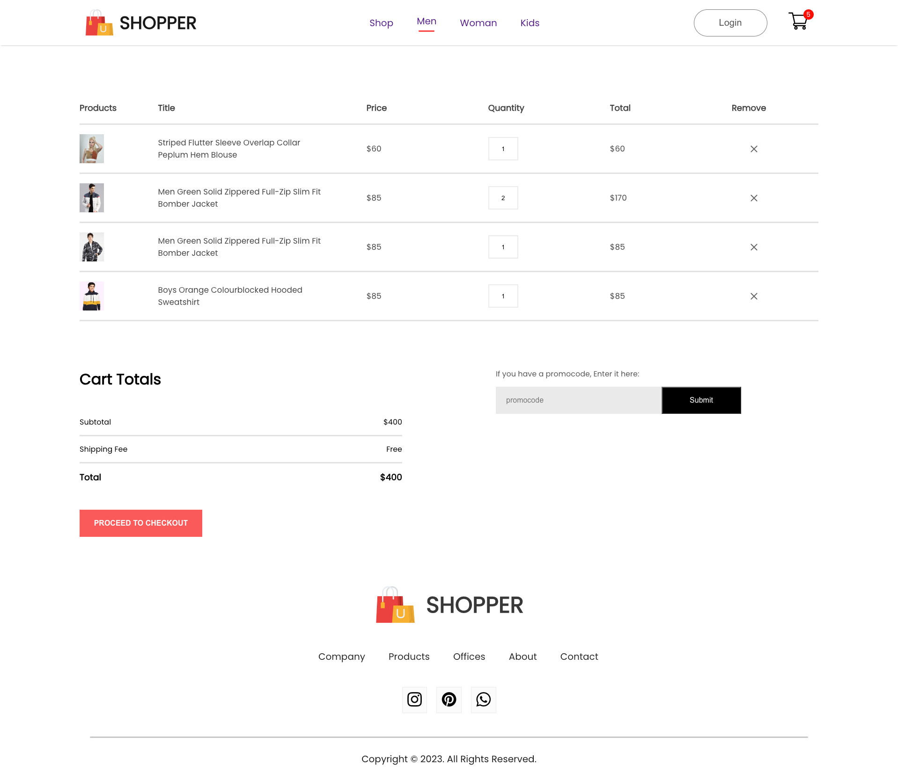
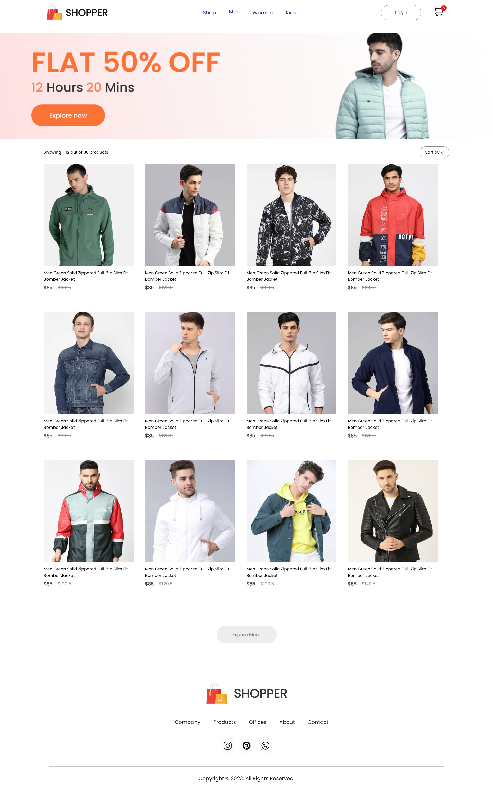
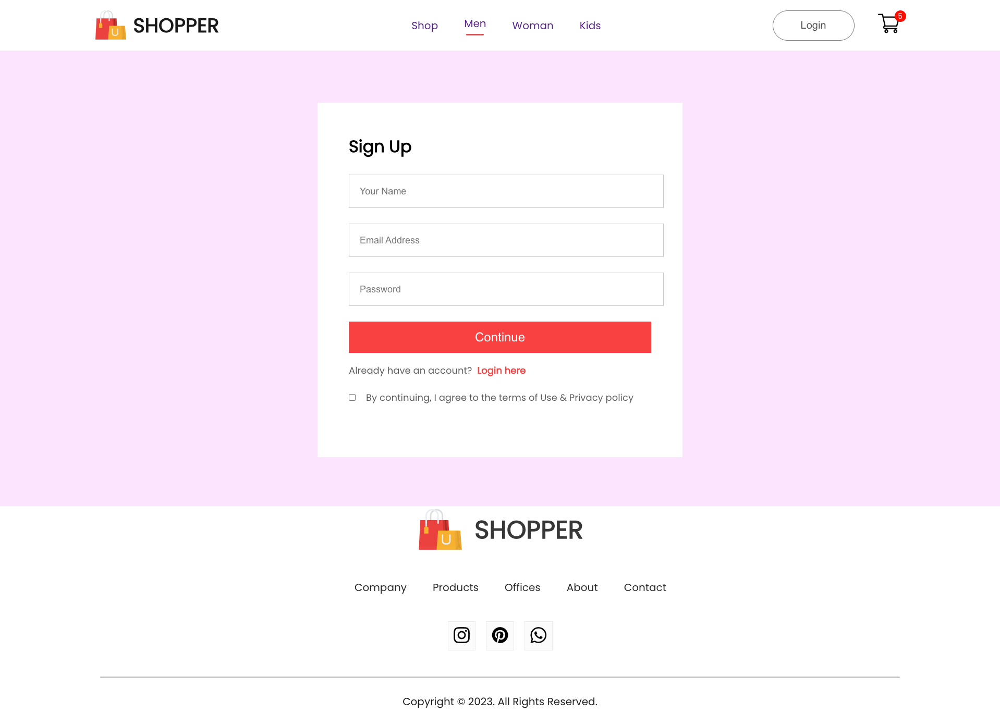

# E-commerce-React-Store

Welcome to the E-commerce-React-Store repository! This project is a dynamic and feature-rich E-commerce website built using the popular JavaScript library, React. With a modern and intuitive user interface, this application provides a seamless shopping experience for both customers and administrators.

## Screenshots 📸

   <h1>1.Main Page</h1>

   

   
   

   

   <h1>2.Cart Page</h1>

   

   
   

   

   <h1>3.Products Page</h1>

   

   
   

   

   <h1>4.Login/SignUp Page</h1>

   

   
   

   

## Key Features

1. **React Components:** Leveraging the power of React, the project is organized into modular and reusable components, ensuring a clean and maintainable codebase.

2. **Responsive Design:** The E-commerce website is designed to be fully responsive, providing an optimal viewing and interaction experience across a wide range of devices, from desktops to smartphones.

3. **State Management:** Redux is employed for efficient state management, enabling the application to handle complex data flow and ensure a consistent state across various components.

4. **Product Catalog:** Users can explore a diverse range of products with detailed descriptions, images, and pricing information. The catalog is dynamically rendered, making it easy to update and expand the product offerings.

5. **Shopping Cart:** A robust shopping cart system allows users to add and remove items, view a summary of their selections, and proceed to checkout seamlessly.

6. **User Authentication:** Secure user authentication is implemented to provide a personalized experience. Customers can create accounts, log in, and track their order history.

7. **Admin Panel:** The administrative section of the application is equipped with tools to manage products, monitor orders, and update inventory. It offers a user-friendly interface for efficient store management.

8. **Payment Integration:** The website supports secure payment transactions through integration with popular payment gateways, ensuring a smooth and reliable checkout process.

## Getting Started

To run the project locally, follow these steps:

1. Clone the repository: `git clone https://github.com/vladimirkratinov/ecommerce-react-website.git`
2. Navigate to the project directory: `cd ecommerce-react-website`
3. Install dependencies: `npm install`
4. Start the development server: `npm start`

Explore the code, experiment with customization, and contribute to the growth of this E-commerce React Store!

Feel free to report issues, contribute enhancements, or suggest new features. Happy coding!
